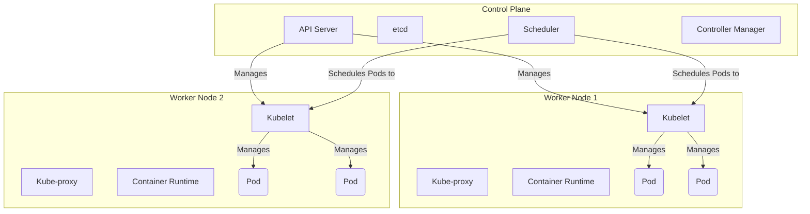

```mermaid
graph TD
    subgraph Control Plane
        A[API Server]
        E[etcd]
        S[Scheduler]
        C[Controller Manager]
    end

    subgraph Worker Node 1
        K1[Kubelet]
        P1[Kube-proxy]
        CR1[Container Runtime]
        Pod1(Pod)
        Pod2(Pod)
    end

    subgraph Worker Node 2
        K2[Kubelet]
        P2[Kube-proxy]
        CR2[Container Runtime]
        Pod3(Pod)
        Pod4(Pod)
    end

    A -- Manages --> K1
    A -- Manages --> K2
    S -- Schedules Pods to --> K1
    S -- Schedules Pods to --> K2
    K1 -- Manages --> Pod1
    K1 -- Manages --> Pod2
    K2 -- Manages --> Pod3
    K2 -- Manages --> Pod4
```
